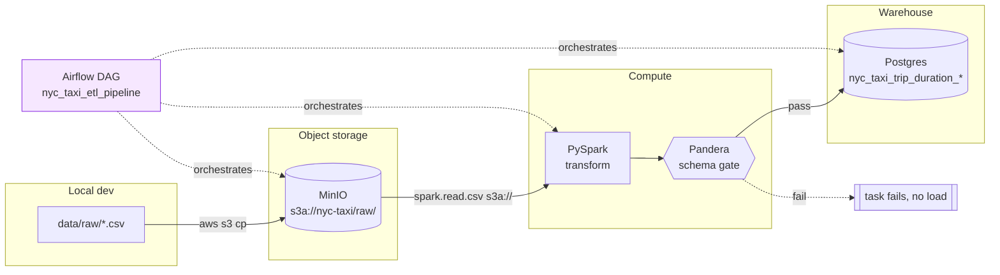

# scalable-etl-pipeline

An ETL pipeline for the Kaggle **NYC Taxi Trip Duration** dataset. It pulls raw
CSVs into MinIO (S3-compatible), transforms them with PySpark, gates the output
behind a Pandera data-quality check, and loads the cleaned data into Postgres.
Orchestrated with Airflow.

> **Status:** portfolio project. Runs end-to-end with `docker compose up`.
> Data-quality gate will fail the DAG on schema regressions.

## Architecture



## What's in the box

| Layer | Tech |
|---|---|
| Orchestration | Airflow 2.5 (`dags/etl_dag.py`) |
| Object store | MinIO (S3 API) |
| Transform | PySpark 3.5 (`scripts/transform.py`) |
| Data quality | Pandera (`etl/validation.py`) |
| Warehouse | Postgres 13 |
| Observability | Prometheus + Pushgateway + postgres-exporter + Grafana |
| Packaging | Docker Compose, Makefile |
| CI | GitHub Actions (lint + pytest) |

## Running it

```bash
# 1. Copy env template and fill in locally
cp .env.example .env
# Generate the two Airflow keys:
python -c "from cryptography.fernet import Fernet; print(Fernet.generate_key().decode())"
python -c "import secrets; print(secrets.token_urlsafe(32))"

# 2. Put the Kaggle dataset in data/raw/
#    (train.csv, test.csv, sample_submission.csv)

# 3. Bring the stack up
make up          # docker compose up -d with healthchecks
make dashboards  # prints URLs for Airflow, Grafana, Prometheus, MinIO

# 4. Trigger the DAG at http://localhost:8080. The load task pushes
#    per-dataset metrics to the Pushgateway; the provisioned Grafana
#    dashboard "NYC Taxi ETL — Pipeline Health" shows them live.
```

## Running tests

```bash
make install-dev
make lint
make test
```

Tests cover the loader's database interaction (mocked) and pin the Pandera
schema contracts so CI will fail loud if the data shape regresses.

## What's intentionally NOT here

- **Horizontal Spark cluster.** Compose runs a single Spark container;
  this is for local dev, not benchmarking.
- **Secrets management beyond `.env`.** Production deploys should use Vault,
  AWS Secrets Manager, or k8s Secrets.

## Design notes

**Why a staging-table `COPY` + `ON CONFLICT` upsert, not `to_sql`?** The
original loader used `df.to_sql(if_exists='replace')`, which dropped and
recreated the target on every run. That's both destructive (downstream
readers briefly see an empty table) and not idempotent in the
data-engineering sense: a corrected row in the source had no way to
overwrite its prior version without hand-SQL. The new path COPYs into a
session-temp staging table (`CREATE TEMP TABLE … LIKE target INCLUDING
DEFAULTS ON COMMIT DROP`), then does a single
`INSERT … SELECT … ON CONFLICT (id) DO UPDATE SET …`. Everything runs in
one transaction, so a mid-load failure leaves the target untouched.

**Why a watermark on top of upsert?** The upsert alone is correct — you
could re-run on the full file every day and never corrupt anything — but
you'd also scan and stage millions of duplicate rows. `get_watermark()`
queries `MAX(pickup_datetime)` and filters the DataFrame before `COPY`, so
reruns on the same input become near-no-ops while genuinely new rows
still flow through. The upsert stays as a safety net for row-level
corrections that arrive inside the watermark window. `--no-watermark`
bypasses the filter for deliberate backfills.

**Why `id` as the conflict key?** Kaggle's `id` is globally unique per
trip, so it's the natural primary key for idempotency. The old DDL had
`(VendorID, pickup_datetime)` as PK — but case-folded to `vendorid` in
Postgres and didn't match the cleaned CSV's `vendor_id` column anyway,
so the server-side `COPY` in the Airflow DAG would have failed on a
real run. The DAG now shells out to `python -m etl.load`, which is the
single code path.

**Why not `to_sql(method='multi')`?** It's the first suggestion most
Stack Overflow answers give for "`to_sql` is slow" and — on this
workload — it's actively slower than the default (see below). It
builds one giant multi-row `INSERT` per chunk; psycopg2 pays a parse
cost per statement that eclipses the savings. `COPY` is the right
primitive, not a different shape of `INSERT`.

### Benchmark: `to_sql` vs `copy_upsert`

Run on macOS (Apple Silicon), Postgres 14, local Unix socket,
1,000,000 synthetic NYC-Taxi rows (~190 MB in-memory). Reproduce with
`python scripts/benchmark_load.py --rows 1000000`:

| Path                                              | Time    | Relative  |
|---------------------------------------------------|---------|-----------|
| `pandas.to_sql(if_exists='replace')` (old)        | 18.15 s | 1.0×      |
| `pandas.to_sql(method='multi', chunksize=1000)`   | 56.72 s | 0.3× (slower) |
| `copy_upsert` (empty target, new)                 |  5.12 s | **3.5× faster** |
| `copy_upsert` (rerun vs. full target)             |  6.44 s | **2.8× faster**, idempotent |

The rerun row is the interesting one: the new loader stays fast even
when every input row conflicts with an existing row, which is the
common case in daily batch reruns.

## Observability

Everything the loader does is visible on a provisioned Grafana
dashboard, no click-ops required:

```
make up          # brings Prometheus, Pushgateway, postgres-exporter, Grafana along with the rest
make dashboards  # prints URLs
```

**What's measured**

| Metric                                    | Source                      | Why it matters                           |
|-------------------------------------------|-----------------------------|------------------------------------------|
| `etl_rows_loaded_total{dataset}`          | Pushgateway ← loader        | Sudden drops = silent upstream breakage. |
| `etl_load_duration_seconds{dataset}`      | Pushgateway ← loader        | Trend catches the "gradual slowdown."    |
| `etl_load_last_success_timestamp_seconds` | Pushgateway ← loader        | Freshness SLO; alert when stale > 24h.   |
| `etl_load_failures_total`                 | Pushgateway ← loader        | One red stat on the dashboard.           |
| `pg_stat_user_tables_n_live_tup`          | postgres-exporter           | Warehouse-side row counts.               |
| `pg_stat_activity_count`                  | postgres-exporter           | Connection pressure + stuck states.      |

**Why Pushgateway and not a long-running `/metrics` endpoint?** The
loader is a batch process that exits after each run. Prometheus'
default pull model assumes a target it can scrape whenever it wants;
exposing a `/metrics` endpoint on a process that isn't running is a
non-starter. Pushgateway is the canonical primitive for one-shot jobs:
the loader pushes on exit, Prometheus scrapes the Pushgateway on its
normal interval. The `etl/metrics.py` recorder no-ops when
`PROMETHEUS_PUSHGATEWAY` is unset, so tests and local dev don't need
the observability stack up.

**Why the `job` + `instance` split?** Per Prometheus guidance, `job`
names the pipeline (`nyc_taxi_load`) and the Pushgateway grouping key
(`instance=train` / `instance=test`) keeps the two datasets as
separate series. Without the grouping key, successive pushes from the
two datasets would clobber each other.

The dashboard JSON lives in
[`observability/grafana/dashboards/etl-overview.json`](observability/grafana/dashboards/etl-overview.json)
— check it in, don't click it into existence. A screenshot goes here
once the stack has been run with real data:
`docs/grafana-dashboard.png` (not yet committed).

**Alert rules.** Prometheus evaluates a small rules file at
[`observability/prometheus/alerts.yml`](observability/prometheus/alerts.yml):
`ETLLoadStale` fires when no dataset has loaded in 24 h,
`ETLLoadFailing` fires on any increment to `etl_load_failures_total`,
and `PostgresExporterDown` catches silent exporter death. An
Alertmanager routing tree is not shipped yet — the rules expose their
state on Prometheus' own `/alerts` page and via the dashboard.

## Roadmap

- [x] Idempotent upsert loads (staging table + `INSERT … ON CONFLICT`, watermark column).
- [x] Replace `pandas.to_sql` with Postgres `COPY` for materially higher throughput.
- [x] Delete `run_all_etl.py`, make Airflow the single source of truth.
- [x] Prometheus metrics + Grafana dashboard for row counts and task duration.
- [ ] Commit a Grafana screenshot after an end-to-end DAG run.
- [x] Alert rules (`observability/prometheus/alerts.yml`) for stale data + failure counter.

## License

MIT — see [LICENSE](LICENSE).
