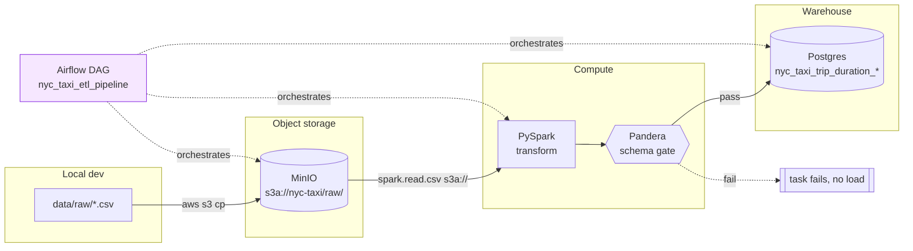

# scalable-etl-pipeline

An ETL pipeline for the Kaggle **NYC Taxi Trip Duration** dataset. It pulls raw
CSVs into MinIO (S3-compatible), transforms them with PySpark, gates the output
behind a Pandera data-quality check, and loads the cleaned data into Postgres.
Orchestrated with Airflow.

> **Status:** portfolio project. Runs end-to-end with `docker compose up`.
> Data-quality gate will fail the DAG on schema regressions.

## Architecture



## What's in the box

| Layer | Tech |
|---|---|
| Orchestration | Airflow 2.5 (`dags/etl_dag.py`) |
| Object store | MinIO (S3 API) |
| Transform | PySpark 3.5 (`scripts/transform.py`) |
| Data quality | Pandera (`etl/validation.py`) |
| Warehouse | Postgres 13 |
| Packaging | Docker Compose, Makefile |
| CI | GitHub Actions (lint + pytest) |

## Running it

```bash
# 1. Copy env template and fill in locally
cp .env.example .env
# Generate the two Airflow keys:
python -c "from cryptography.fernet import Fernet; print(Fernet.generate_key().decode())"
python -c "import secrets; print(secrets.token_urlsafe(32))"

# 2. Put the Kaggle dataset in data/raw/
#    (train.csv, test.csv, sample_submission.csv)

# 3. Bring the stack up
make up          # docker compose up -d with healthchecks

# 4. Trigger the DAG
#    Airflow UI at http://localhost:8080, MinIO console at http://localhost:9001
```

## Running tests

```bash
make install-dev
make lint
make test
```

Tests cover the loader's database interaction (mocked) and pin the Pandera
schema contracts so CI will fail loud if the data shape regresses.

## What's intentionally NOT here

- **Streaming / incremental loads.** The Postgres load is full-refresh
  (`if_exists='replace'`). Real incremental support is in the backlog —
  see [Roadmap](#roadmap).
- **Horizontal Spark cluster.** Compose runs a single Spark container;
  this is for local dev, not benchmarking.
- **Secrets management beyond `.env`.** Production deploys should use Vault,
  AWS Secrets Manager, or k8s Secrets.

## Roadmap

- [ ] Idempotent upsert loads (staging table + `INSERT … ON CONFLICT`, watermark column).
- [ ] Replace `pandas.to_sql` with Postgres `COPY` for 10×+ throughput.
- [ ] Delete `run_all_etl.py`, make Airflow the single source of truth.
- [ ] Prometheus metrics + Grafana dashboard for row counts and task duration.

## License

MIT — see [LICENSE](LICENSE).
